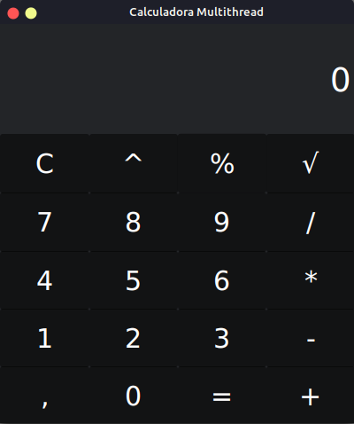

#Calculadora Distribuida
Projeto desenvolvido em Java para a matéria de sistemas distribuidos, ministrada pelo Profº Thomas Rabelo no curso de ciência da computação da FACAPE.

##Ferramentas
- Intellij IDEA
- Java
- Socket
- JavaFX

##Sobre
A calculadora faz conexão com dois servidores especialistas, um servidor simples e um servidor especial. A conexão com esses servidores é feita de forma transparente.

#####Servidor Simple
- Escuta a porta 9998
- Operações
    - Soma
    - Subtração
    - Multiplicação
    - Divisão
- Protocolo
    - Requisição
        - O servidor recebe uma string onde está a operação a ser feita, os valores são separados por um escpaço em branco. Ex:
            > valor1 + " " + operador + " " + valor2
    - Response
        - O servidor retorna uma string com o resultado da operação.
          Ex: 
          > "52"

#####Servidor Especial
- Escuta a porta 9999
- Operações
    - Porcentagem
    - Raiz Quadrada
    - Porcentagem
- Protocolo
    - Requisição
        - O servidor recebe uma string onde está a operação a ser feita, os valores são separados por um escpaço em branco. Ex:
            > valor1 + " " + operador + " " + valor2
    - Response
        - O servidor retorna uma string com o resultado da operação.
          Ex: 
          > "52"

##Imagem
